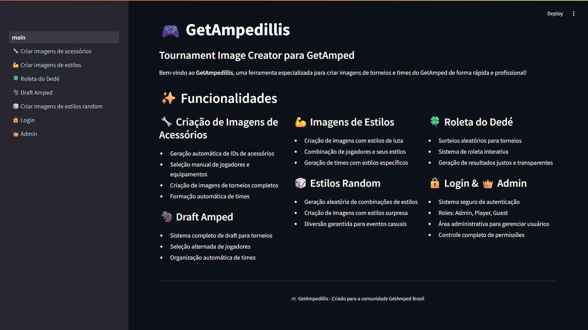

# Tournament Image Creator

This project is a tool for generating images for teams and tournaments, specifically designed for GetAmped events. Users can input team and tournament data, and the app will automatically generate visually appealing images based on the provided information. It is ideal for organizers who want to quickly create shareable graphics for their events.

## Authentication & permissions

**User authentication is required to access the app.**
- The app supports multiple user roles: `admin`, `player`, and `guest`.
- Permissions and access to features are determined by your role.

### Role-based Permissions
- **Admin**: Can create new users, assign roles, and access the admin area.
- **Player**: Can upload player images and access main features.
- **Guest**: Has limited access, useful for testing or demo purposes.

> **Guest login:** Use username `guest` and password `guest` to try the app as a guest.

### Admin Area
- Only users with the `admin` role can access the user creation page and manage user roles.
- Admins can create new users and assign roles directly from the app interface.

## App preview

You can try the app online here: [https://getampedvive.streamlit.app/](https://getampedvive.streamlit.app/)



## How to run

Follow these steps to set up and run the app on your local machine:

### 1. Install Python
If you do not have Python installed, download and install the latest version from [python.org](https://www.python.org/downloads/).

### 2. Download the project
Download the project files from the repository (either by cloning or downloading the ZIP).

### 3. Extract the project
Extract the ZIP file (if downloaded as ZIP) to a folder of your choice.

### 4. Create a virtual environment (recommended)
Open a terminal or command prompt in the project folder and run:
```bash
python -m venv venv
```

Activate the virtual environment:
```bash
venv\Scripts\activate
```

### 5. Install dependencies
Install the required Python packages:
```bash
pip install -r requirements.txt
```

### 6. Run the app
Start the Streamlit app with:
```bash
python -m streamlit run 🔒Login.py
```

After running the above command, open your browser and go to [http://localhost:8501](http://localhost:8501/) to use the app.

**Note:** Steps 4 and 5 only need to be done once per setup. If you add new dependencies later, rerun step 5.
