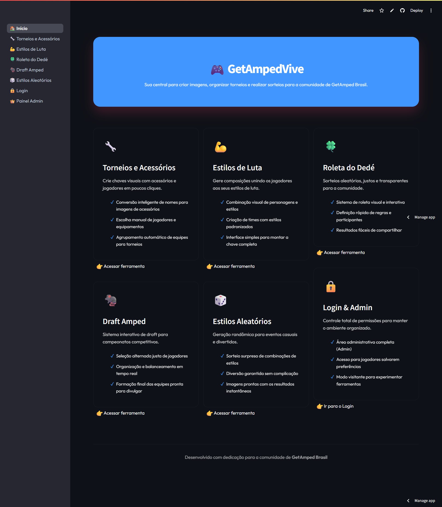

# 🎮 GetAmpedVive - Ferramentas e Torneios

**GetAmpedVive** é uma aplicação completa em Streamlit criada especificamente para gerar imagens profissionais de torneios e gerenciar eventos de GetAmped. Esta ferramenta poderosa combina reconhecimento de acessórios via IA, múltiplos modos de geração de imagens, ferramentas de sorteio e draft, além de autenticação de usuários, fornecendo uma solução centralizada para a comunidade de GetAmped Brasil.

## ✨ Principais Funcionalidades

### 💫 Experiência do Usuário (UX) Aprimorada

- **Downloads Universais**: Botões nativos disponíveis para download rápido de qualquer imagem gerada, com nomenclaturas padronizadas.
- **Feedback Visual**: Indicadores de carregamento (*spinners*) garantem que você saiba quando uma imagem pesada está sendo processada.
- **Persistência de Dados**: O aplicativo salva suas imagens e progresso temporariamente para evitar a perda do seu trabalho durante a navegação na página.

### 🔧 Torneios e Acessórios

- **Geração de IDs via IA** *(Nota: Atualmente desativado na interface principal para redução de custos, mas disponível na base de código para uso futuro)*: Utiliza embeddings vetoriais do Supabase e a IA do Google Gemini para converter automaticamente nomes de acessórios em IDs reais.
- **Seleção Manual**: Interface interativa para selecionar jogadores e equipamentos de forma precisa.
- **Imagens de Torneios**: Cria imagens de chaves de torneio completas.
- **Formação Automática de Times**: Organização inteligente e geração de imagens de equipes agrupadas.

### 💪 Estilos de Luta

- **Integração de Estilos de Luta**: Crie composições unindo os jogadores aos seus respectivos estilos.
- **Banco de Dados de Estilos**: Uma coleção completa e atualizada dos estilos de luta do GetAmped.
- **Combinações de Times**: Gere imagens de equipes exibindo os estilos escolhidos.

### 🍀 Roleta do Dedé

- **Sistema de Sorteio Aleatório**: Uma roleta interativa visual para realizar sorteios justos nos torneios.
- **Opções Customizáveis**: Configure quais linhas/equipamentos serão sorteados e quais ficarão fixos.
- **Integração Fluida**: Faça o upload das imagens de times geradas nas outras abas para aplicar a roleta.

### 🐀 Draft Amped

- **Interface Profissional de Draft**: Sistema de banimentos (picks e bans) interativo para torneios competitivos.
- **Seleção Interativa**: Marque visualmente as linhas (equipamentos) banidas para escurecê-las em tempo real.
- **Pronto para Divulgação**: Baixe a imagem final da equipe pós-draft para usar diretamente no campeonato.

### 🎯 Roleta do Vitin

- **Sorteio Dinâmico e Condicional**: Duas roletas interativas simultâneas, onde o resultado da primeira dita as opções da segunda.
- **Integração de Categorias**: O sorteio de "Regras" injeta automaticamente as opções de "Estilos" com base nas categorias do jogo.
- **Edição em Tempo Real**: Adicione e modifique as opções e regras diretamente pela interface.

### 🎲 Estilos Aleatórios

- **Geração Surpresa**: Gere combinações aleatórias e inesperadas de estilos para os jogadores.
- **Filtros por Categoria**: Escolha categorias específicas de estilos (como BASIC, FUSION, RIVAL) para os sorteios.
- **Foco Casual**: Ferramenta perfeita para eventos divertidos e campeonatos não-competitivos.

### 🔒 Login & Admin

- **Painel Administrativo Completo**: Área dedicada para a gestão total da plataforma.
- **Acesso Seguro**: Sistema de permissões garantindo que visitantes não alterem os dados.
- **Controle de Jogadores**: Gestão de dados salvos por cada conta logada.

## 🚀 Recursos Técnicos

### 🤖 Integração com Inteligência Artificial
*(Nota: As funcionalidades de Inteligência Artificial não estão sendo utilizadas na interface principal atualmente, mas todo o código e infraestrutura estão mantidos para uso futuro)*

- **Google Gemini AI**: Processamento de linguagem natural avançado para reconhecer os nomes dos acessórios digitados.
- **Supabase Vector Embeddings**: Busca por similaridade super rápida (RAG) utilizando vetores.
- **Match Inteligente**: Converte nomes descritivos e apelidos para os IDs precisos do jogo com alta taxa de acerto.
- **Ciente de Contexto**: Entende as terminologias específicas usadas pela comunidade de GetAmped.

### 🏗️ Arquitetura

- **Design Modular**: Separação limpa de responsabilidades com serviços dedicados.
- **Integração com Banco de Dados**: Suporte nativo ao PostgreSQL e Supabase.
- **Processamento de Imagens**: Composição avançada de imagens utilizando PIL.
- **Cache**: Desempenho otimizado usando o sistema de cache do Streamlit.

### 🔒 Segurança e Autenticação

- **Sistema de Papéis (Roles)**: Gerenciamento abrangente de perfis de usuário.
- **Autenticação Segura**: Hash de senhas utilizando BCrypt.
- **Sessões Contínuas**: Gerenciamento de sessões de login persistentes.
- **Controle de Acesso**: Funcionalidades bloqueadas ou liberadas com base no nível de permissão do usuário.

## 👥 Perfis de Usuário e Permissões

**O aplicativo requer autenticação para algumas áreas e suporta três papéis distintos:**

### 👑 Admin

- **Acesso Total**: Acesso irrestrito a todas as ferramentas e painel administrativo.
- **Gerenciamento de Usuários**: Pode criar, editar e excluir contas.
- **Atribuição de Papéis**: Pode conceder cargos e permissões a outros usuários.
- **Configuração do Sistema**: Acesso a opções avançadas.

### 🎮 Player

- **Recursos Principais**: Acesso às ferramentas de criação de imagens e drafts.
- **Gestão de Torneios**: Uso irrestrito da Roleta e Draft Amped.
- **Uploads Personalizados**: Pode adicionar imagens customizadas de estilos e acessórios.
- **Perfil**: Atualização de preferências pessoais.

### 👁️ Guest (Visitante)

- **Acesso Limitado**: Visão básica da plataforma.
- **Modo Demo**: Perfeito para testar e conhecer as ferramentas.
- **Sem Modificações**: Não pode salvar nem alterar dados oficiais.

> **🎯 Acesso Rápido para Testes:** Use o nome de usuário `guest` e a senha `guest` para explorar o aplicativo sem precisar se registrar.

## 📱 Pré-visualização do Aplicativo

Você pode testar a versão online aqui: [https://getampedvive.streamlit.app/](https://getampedvive.streamlit.app/)



## 🛠️ Instalação e Configuração

### Pré-requisitos

- **Python 3.12+**: Faça o download em [python.org](https://www.python.org/downloads/)
- **Git**: Para clonar este repositório
- **Chave de API do Google Gemini**: Para as funções de IA (opcional para uso básico)
- **Conta no Supabase**: Para busca de acessórios via vetores (necessário para funções de IA)

### Começando Rapidamente

1. **Clone o Repositório**

   ```bash
   git clone https://github.com/stevillis/getampedvive.git
   cd getampedvive
   ```

2. **Crie um Ambiente Virtual**

   ```bash
   python -m venv venv

   # Windows
   venv\Scripts\activate

   # Linux/macOS
   source venv/bin/activate
   ```

3. **Instale as Dependências**

   ```bash
   pip install -r requirements.txt
   ```

4. **Configuração de Variáveis de Ambiente (Opcional)**
   Crie um arquivo `.env` na raiz do projeto:

   ```env
   GETAMPEDVIVE_GEMINI_API_KEY=sua_chave_de_api_gemini_aqui
   GETAMPEDVIVE_GEMINI_MODEL=gemini-3.1-flash-lite-preview
   GETAMPEDVIVE_GEMINI_EMBEDDING_MODEL=gemini-embedding-001
   SUPABASE_URL=sua_url_supabase_aqui
   SUPABASE_KEY=sua_chave_supabase_aqui
   DATABASE_URL=sua_url_postgresql_aqui  # Opcional
   ```

5. **Execute a Aplicação**

   ```bash
   streamlit run main.py
   ```

6. **Acesse o App**
   Abra o seu navegador e acesse: [http://localhost:8501](http://localhost:8501)

## 🔧 Configurações Adicionais

### Configurando as Features de IA

*(Nota: Como as features de IA não estão sendo utilizadas na interface principal, esta configuração é opcional e serve apenas se você reativar os serviços no código)*

Para ativar o reconhecimento inteligente de acessórios:

1. Obtenha uma chave de API no [Google AI Studio](https://aistudio.google.com/)
2. Crie um projeto no [Supabase](https://supabase.com/) e execute o SQL contido em `embeddings/create_table_accessory_embeddings.sql`
3. Gere os embeddings de acessórios rodando `python embeddings/generate_acesssory_embeddings.py`
4. Adicione as chaves e credenciais ao seu arquivo `.env`
5. A aplicação irá detectar e habilitar automaticamente os recursos de inteligência artificial.

### Banco de Dados

- **Supabase**: Usado primariamente para vetores e busca por similaridade.
- **PostgreSQL**: Configure `DATABASE_URL` para suporte a banco relacional em produção.
- **Migração**: Ferramentas de migração automática de dados estão inclusas.

### Dados Customizados

- **Jogadores**: Adicione as imagens dos avatares na pasta `data/players/`
- **Acessórios**: Adicione as imagens de acessórios na pasta `data/accs/`
- **Estilos**: Adicione as imagens de estilos de luta na pasta `data/styles/`

## 🧪 Testes

Rode a suíte de testes com cobertura para garantir que tudo está funcionando perfeitamente:

1. **Rodar Testes com Cobertura**

   ```bash
   coverage run -m pytest
   ```

2. **Ver Relatório no Terminal**

   ```bash
   coverage report -m
   ```

3. **Gerar Relatório HTML**

   ```bash
   coverage html
   ```

4. **Servir o Relatório HTML Localmente**

   ```bash
   python -m http.server
   ```

   Em seguida, abra [http://localhost:8000/htmlcov/](http://localhost:8000/htmlcov/) no seu navegador para navegar detalhadamente pela cobertura de código.

---

**Feito com ❤️ para a comunidade de GetAmped Brasil**
