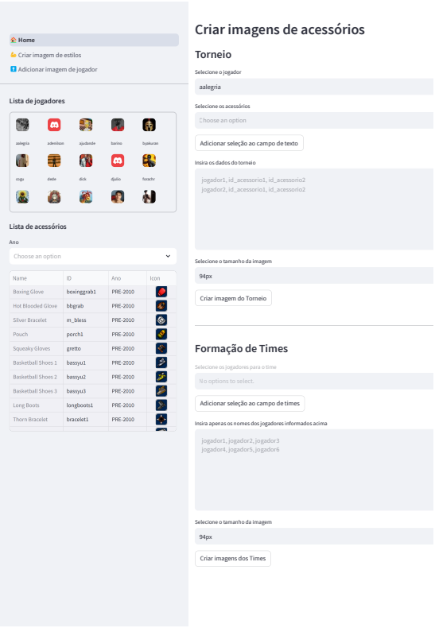

# 🎮 GetAmpedillis - Tournament Image Creator

**GetAmpedillis** is a comprehensive Streamlit application designed specifically for creating professional tournament images and managing GetAmped events. This powerful tool combines AI-powered accessory recognition, multiple image generation modes, tournament management features, and user authentication to provide a complete solution for GetAmped tournament organizers.

## ✨ Key Features

### 🔧 Smart Accessory Image Creation
- **AI-Powered ID Generation**: Uses Google Gemini AI to automatically convert accessory names to IDs
- **Manual Selection**: Interactive interface for precise accessory and player selection
- **Tournament Image Generation**: Creates complete tournament bracket images
- **Automatic Team Formation**: Intelligent team organization and image creation

### 💪 Style-Based Image Creation
- **Fighting Style Integration**: Create images combining players with their fighting styles
- **Style Database**: Comprehensive collection of GetAmped fighting styles
- **Team Style Combinations**: Generate team images with unified or mixed styles

### 🍀 Roleta do Dedé (Lottery System)
- **Random Selection Tool**: Interactive lottery wheel for fair tournament draws
- **Customizable Options**: Configure participants and selection criteria
- **Tournament Integration**: Seamlessly integrate results into other tools

### 🐀 Draft Amped (Advanced Draft System)
- **Professional Draft Interface**: Complete draft system for competitive tournaments
- **Alternating Selection**: Fair player distribution across teams
- **Real-time Updates**: Live draft progression and team formation

### 🎲 Random Style Generator
- **Surprise Combinations**: Generate unexpected style and player combinations
- **Casual Event Support**: Perfect for fun, non-competitive tournaments
- **Infinite Possibilities**: Endless combinations for creative events

## 🚀 Technical Features

### 🤖 AI Integration
- **Google Gemini AI**: Advanced natural language processing for accessory recognition
- **Smart Name Matching**: Converts descriptive names to precise accessory IDs
- **Fuzzy Matching**: Handles typos and variations in accessory names
- **Context-Aware**: Understands GetAmped-specific terminology

### 🏗️ Architecture
- **Modular Design**: Clean separation of concerns with dedicated services
- **Database Integration**: Support for PostgreSQL and local file storage
- **Image Processing**: Advanced PIL-based image composition
- **Caching**: Optimized performance with Streamlit caching

### 🔒 Security & Authentication
- **Multi-Role System**: Comprehensive user role management
- **Secure Authentication**: BCrypt password hashing
- **Session Management**: Persistent login sessions
- **Permission Control**: Feature access based on user roles

## 👥 User Roles & Permissions

**The app requires authentication for access and supports three distinct user roles:**

### 👑 Admin
- **Full Access**: All features and administrative functions
- **User Management**: Create, edit, and delete user accounts
- **Role Assignment**: Manage user permissions and roles
- **System Configuration**: Access to advanced settings

### 🎮 Player
- **Core Features**: Access to all image creation tools
- **Tournament Management**: Use draft and lottery systems
- **Image Upload**: Add custom player and style images
- **Profile Management**: Update personal information

### 👁️ Guest
- **Limited Access**: View-only access to basic features
- **Demo Mode**: Perfect for testing and demonstrations
- **No Modifications**: Cannot save or modify data

> **🎯 Quick Test Access:** Use username `guest` and password `guest` to explore the app without registration.

## App preview

You can try the app online here: [https://getampedvive.streamlit.app/](https://getampedvive.streamlit.app/)



## 🛠️ Installation & Setup

### Prerequisites
- **Python 3.12+**: Download from [python.org](https://www.python.org/downloads/)
- **Git**: For cloning the repository
- **Google Gemini API Key**: For AI features (optional for basic functionality)

### Quick Start

1. **Clone the Repository**
   ```bash
   git clone https://github.com/stevillis/getampedillis.git
   cd getampedillis
   ```

2. **Create Virtual Environment**
   ```bash
   python -m venv venv
   
   # Windows
   venv\Scripts\activate
   
   # Linux/macOS
   source venv/bin/activate
   ```

3. **Install Dependencies**
   ```bash
   pip install -r requirements.txt
   ```

4. **Environment Configuration (Optional)**
   Create a `.env` file in the root directory:
   ```env
   GETAMPEDVIVE_GEMINI_API_KEY=your_gemini_api_key_here
   GETAMPEDVIVE_GEMINI_MODEL=gemini-2.5-flash
   DATABASE_URL=your_postgresql_url_here  # Optional
   ```

5. **Run the Application**
   ```bash
   streamlit run main.py
   ```

6. **Access the App**
   Open your browser and navigate to: [http://localhost:8501](http://localhost:8501)

## 🔧 Configuration

### AI Features Setup
To enable AI-powered accessory recognition:

1. Get a Google Gemini API key from [Google AI Studio](https://aistudio.google.com/)
2. Add it to your `.env` file or set as environment variable
3. The app will automatically detect and enable AI features

### Database Configuration
- **Default**: Uses local Excel files for data storage
- **PostgreSQL**: Set `DATABASE_URL` for production database support
- **Migration**: Automatic data migration tools available

### Custom Data
- **Players**: Add player images to `data/players/` directory
- **Accessories**: Add accessory images to `data/accs/` directory  
- **Styles**: Add style images to `data/styles/` directory

---

**Made with ❤️ for the GetAmped Brasil community**
